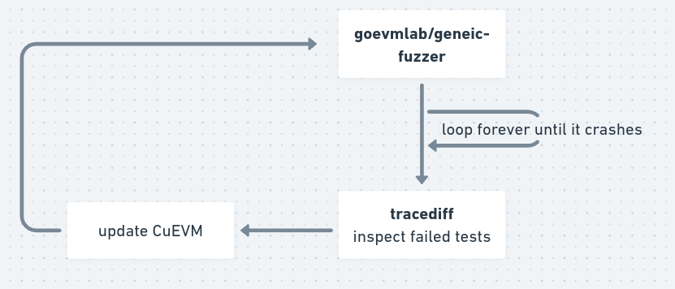

## CuEVM updates: precompile contracts and tests

<div style="text-align: center;">
By Minh, Dan, CL
</div>


---

## Precompile contracts

- What are they?
  - special contracts built into the EVM
  - perform specific operations that would be costly or impractical to implement in
    regular Solidity code
  - typically implemented in the EVM execution engine

---

## CuEVM precompiles implementation status


-  ecRecover, ecAdd, ecMul, and ecPairing. by Minh
-  Identity, Modexp, SHA-256 by Dan
-  Blake2f, RIPEMD-160 by CL

---

## Tests: ethereum/tests

ethereum/tests (https://github.com/ethereum/tests)
  - Test are defined in json files
    - it contains pre states and expected post stateRoot
    - <span style="color:red">a single test can contain transactions for different hard forks</span>
  - We used this to compare execution traces between REVM and CuEVM
  - <span style="color:red"> Test can take a long time to run (~17 minutes for SSTORE opcode test)</span>
  - Few EVMs can pass all the tests: http://retesteth.ethdevops.io/


---

## Tests: goevmlab

[goevmlab](https://github.com/holiman/goevmlab) tests protocol implemtations:
  - comparing results between different EVM implementations
  - generating and running Fuzz tests
  - tracediff: compare traces


Difference from ethereum/tests:
- only support single test in the input json
- some `post` information (stateRoot, logsRoot, etc) are ignored

---


## CuEVM + goevmlab: fuzz test



---

## CuEVM + goevmlab: Fuzz test example

``` bash
> generic-fuzzer --revme binaries/revm --geth geth \
    --cuevm ~/projects/sbip-sg/CuEVM/out/cpu_debug_interpreter --fork Shanghai
...
...
INFO [03-25|10:24:51.072] Shortcutting through abort
Consensus error
Testcase: /tmp/00000000-mixed-3.json
- geth-0: ./geth-0-output.jsonl
  - command: /home/garfield/bin/geth --json --noreturndata --nomemory statetest /tmp/00000000-mixed-3.json
- revm-0: ./revm-0-output.jsonl
  - command: binaries/revm statetest --json /tmp/00000000-mixed-3.json
- cuevm-0: ./cuevm-0-output.jsonl
  - command: /home/garfield/projects/sbip-sg/CuEVM/out/cpu_debug_interpreter --input /tmp/00000000-mixed-3.json --output /dev/null
-------
prev:           both: {"depth":1,"pc":364,"gas":7977163,"op":242,"opName":"CALLCODE","stack":["0x0","0xd5","0x0","0xbc","0x9","0x5140bd9b2f284cb4796c697a8a530981e13c1a92ce7ec16d206199ea19ddbae"]}
diff:         geth-0: {"depth":1,"pc":365,"gas":7970059,"op":80,"opName":"POP","stack":["0x1"]}
diff:        cuevm-0: {"depth":1,"pc":365,"gas":7945059,"op":80,"opName":"POP","stack":["0x1"]}
```

---

## goevmlab: Tracediff

``` bash
❯ tracediff cuevm-0-output.jsonl geth-0-output.jsonl
```


<!-- Caveats: -->
<!-- - no memory data -->
<!-- - no intermediate account storage data -->

---

## Problems with Fuzz test

Problems:
- has no contraol on what kind of tests to run
- the generated transaction can be very complex, not helpful for debugging failed tests

---

## CuEVM + goevmlab + ethereum/tests:


---

<!-- TODO a slide about current test results? -->


## Future work

- Implement all the precompiled contracts
- Fix test failures for both CPU and GPU implementations
- Peformance tuning
- Update to support the latest Cancun fork
- Compare log events
- Compute stateRoot in CuEVM


---

### Thank You & Questions
